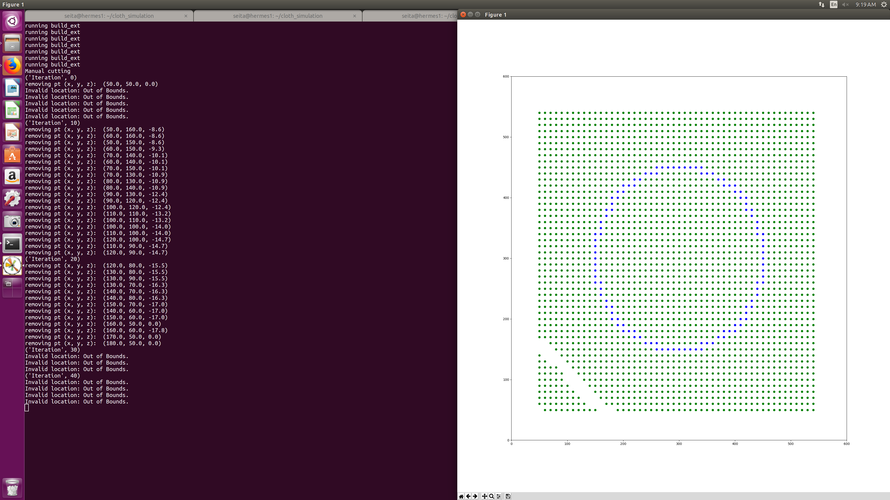
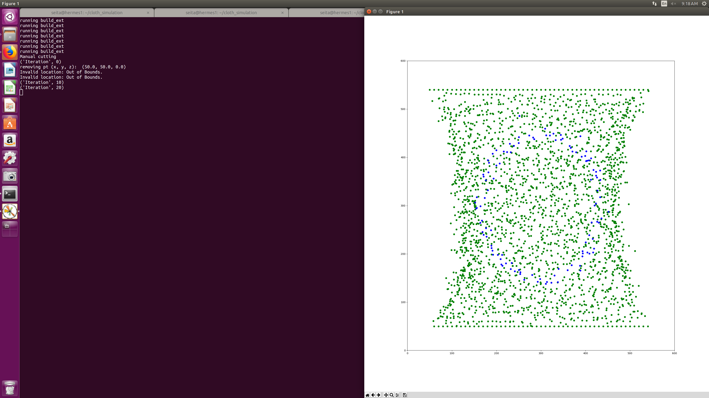
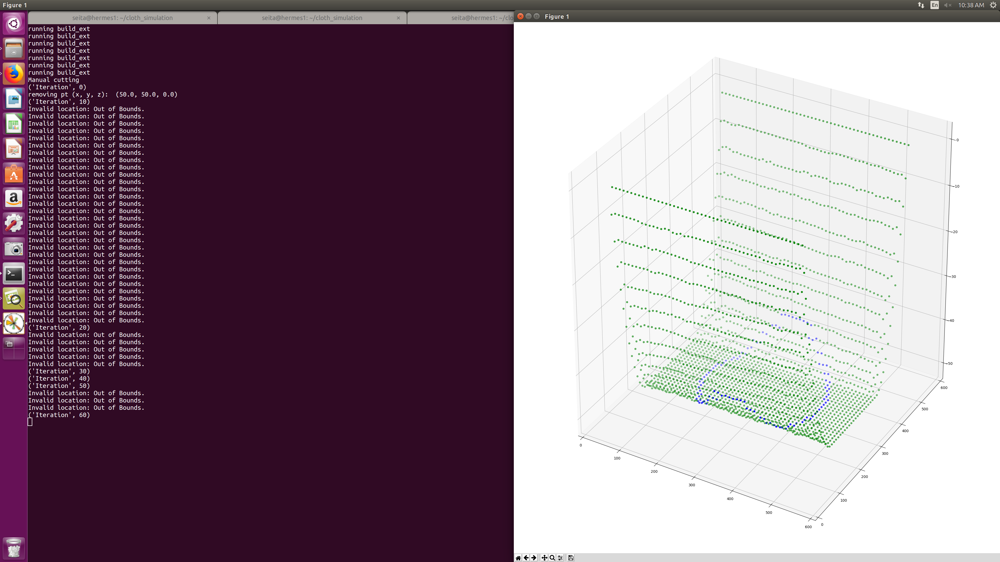
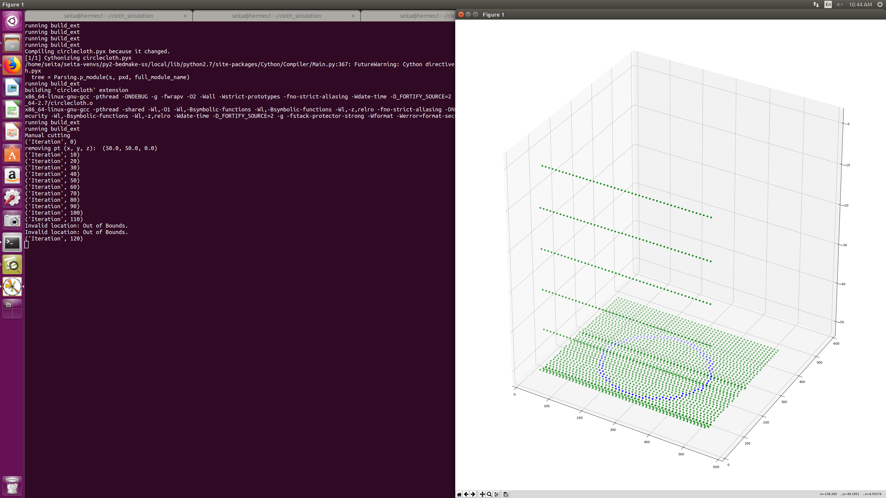
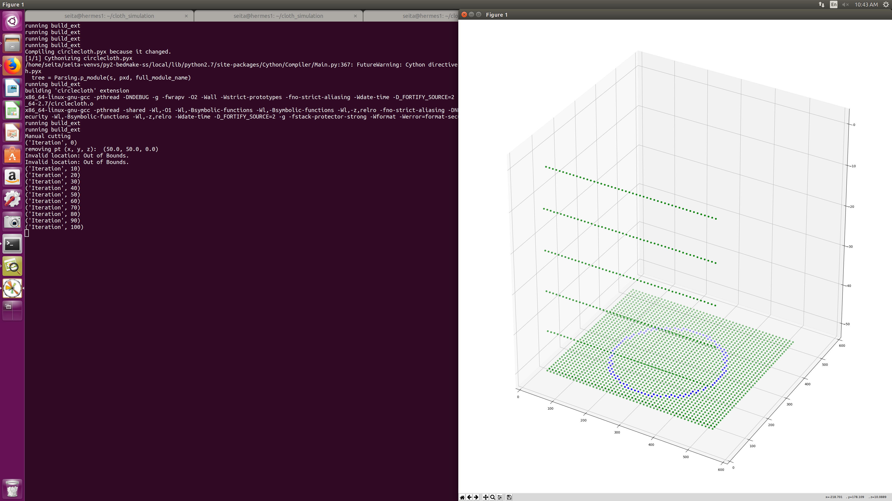
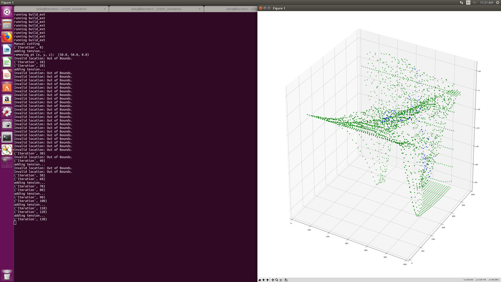
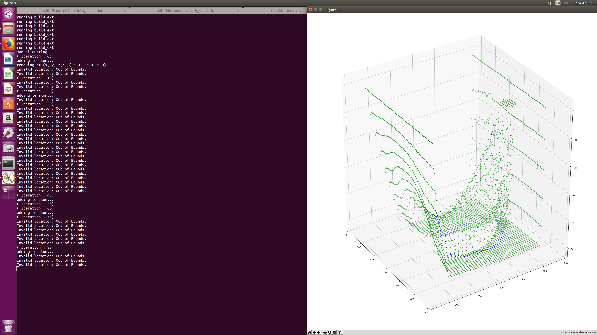
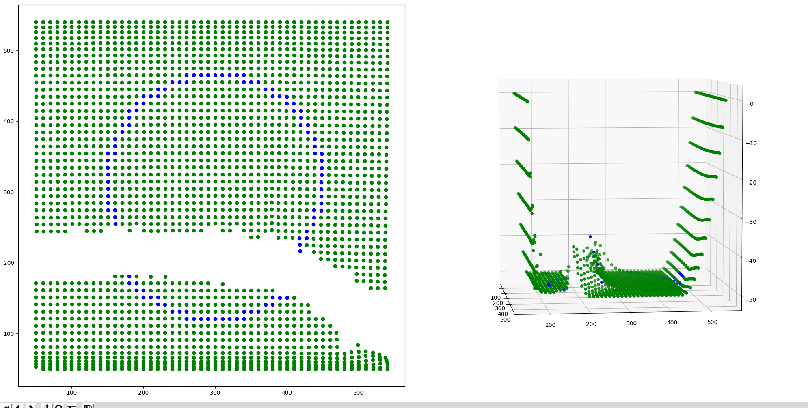
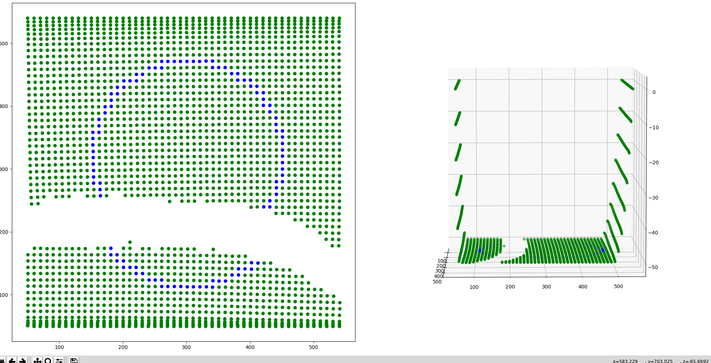

# cloth_simulation

This repository contains scripts used to simulate cloth physics in 3D under various conditions and interactions.

Questions to consider and possible TODOs:

- Why is elasticity implemented the way it is, and why does it work?
- Gravity constant seems very arbitrary, not sure how accurate it has to be for
  physics modeling if we're using the z coordinate?
- How can we support actions like grasping and pulling? How can we adapt the
  tension code so that it correctly lifts the points and then pulls, so we have
  overlap?

Resolved:

- What's with vx, vy, vz? Seems like that contains the acceleration term needed
  for Verlet integration? (Update: looks like it's a naming error, it's clearly
  acceleration.)
- The constant of 0.016 for `pt.update(0.016)` was simply hand-tuned.
- Why not diagonal constraints? I thought that would cause a collapse? Update:
  actually I don't think it's necessary because seems like the gravity is strong
  enough to pull the points downwards. I included these constraints and let's
  just keep them for completeness.
- Better 3D viewer? I kind of have one now, with 2D to the left and 3D to the
  right. With this arrangement, cutting will *still* work as expected with the
  mouse, because the 3D plot is 'out of range' of the cutting.

## Files, Scripts, and Directories:

### point.py
Contains the Point class, which represents a point mass.

### constraint.py
Contains the Constraint class, which represents a relationship between two points that the points try to maintain.

### cloth.py
Contains the Cloth class, which represents a collection of points structured into a rectangular grid in 3D along with perpendicular constraints for each point. The cloth is pinned along the top and bottom by default. It can also be grabbed and tensioned by a tensioner object.

### circlecloth.py
Contains the CircleCloth class which extends the Cloth class. It is similar, but also has a circular pattern drawn on it with specified dimensions/location, and can be grabbed and tensioned as well. The cloth is pinned along the top and bottom by default as well.

### shapecloth.py
Contains a ShapeCloth class which extends the Cloth class. Similar to the CircleCloth class, it has a pattern drawn on it. It takes in a function that specifies whether or not a point is on the outline.

### tensioner.py
Contains the Tensioner class which can be used to grab a position on the cloth, and tug it in a direction.

### mouse.py
Contains the Mouse class, which can be used as a medium through which a physical or virtual mouse can interact with a cloth.

### util.py
Contains utility functions relating to the scripts and objects in the repository.

### demo.py
Contains a main method that can be run out of the box to view a demo of the code in action.

(Daniel update: I change the code somewhat, you should still compile it but just
run the demo without any arguments.)


#### To run:

Run python setup.py build_ext --inplace

To run an trial that cuts a predefined trajectory on a Cloth object, run "python demo.py" in the terminal from within the directory containing the scripts.
To run a trial that takes in the physical mouse's location on the canvas as the location of the scissors, run "python demo.py manual" in the terminal from within the directory containing the scripts.

### simulation.py
Contains a simulation object class that can be used for running simulations with different cloth objects. See the main method for example usage.

#### To run:

Run python setup.py build_ext --inplace

To run a trial that cuts a predefined trajectory on a CircleCloth object, run "python simulation.py" in the terminal from within the directory containing the scripts.

### environment_rep

A package containing environments defined for various experiments with various frameworks such as RLPy or rllab.

### config_files

A folder containing configuration files that can be used to generate simulation objects. An example is default.json.

### Dependencies

* Python 2.7
* Matplotlib
* Numpy
* Scipy 0.18.0 or newer
* Cython
* IPython

### Optional Dependencies

Dependencies that are only required for specific scripts in the repository, but not for core functionality.

* rllab
* RLPy
* OpenAI Gym
* ROS
* dvrk_utils


## Figures

Here are some figures taken in order of when I implemented or tested certain
features.

### Elasticity

Brijen used elasticity of 1.0 by default. If you do 0.0, the structure appears
very rigid with and without diagonal constraints (assuming diagonal constraints
were implemented correctly...):



and if it's 2.0 it collapses, with and without the same diagonal constraints.




### 3D Minimum Z Coordinate

I managed to get a 3D view. You can rotate these, but it will revert back soon
due to the constant updating. (Not sure how we can get around that ...)

Here's the view with a minimum z-coordinate of 50, and with elasticity of 1.0
and with the top and bottom y-coordinate rows pinned (the default). It makes
sense!



### 3D Diagonal Constraints

Good news, diagonal constraints seem to make it more resistant to collapse, but
the effect is not quite as strong as we'd expect. See this without diagonal
constraints:



and with diag:



The cloth is slightly more 'stretched' with the diagonal one by looking at the
y-coordinates, and these were taken at similar iterations, with elasticity of
1.0 and minimum z of -50.

### 3D and Elasticity

If you make elasticity of 0.0, then you don't get any of the points at
intermediate heights between 0 and -50, for some reason, the points just go
straight down to the -50 z axis coordinate. So, elasticity of 1.0 is helpful.
Happens with and without diagonal constraints.

Ah, I changed the minimum z axis to be very low. Without any elasticity (setting
it to 0) then this will cause points to tear, because they simply go straight
down due to gravity, and will soon exceed the `tear_dist` threshold that we set.
With elasticity, this allows for 'flexibility' and 'spring-like' behavior.


### Tensioning

Using standard settings as earlier, with min z coordinate of 50 and diagonal
constraints, I tried the tensioning code to grip the center, then move to the
upper left corner, then back to the lower left. Here are two attempts with
different elasticity terms:

Elasticity 1.0:



Elasticity 0.1:



So, elasticity of 1.0 seems way too unstable, we're seeing points go *above*
z=0.0??? Fortunately elasticity 0.1 seems appropriate.


### Two Views

I finally got two views enabled.  Here they are:



And yeah, cutting works! Just click on the leftmost figure. The rightmost figure
is correctly 'out of bounds'. :-)

But, gravity is weird. Why are some of the points near the cutting region stuck
in mid-air? Well, I set the gravity constant as -10 when creating the cloth:

```
c = CircleCloth(mouse, width=50, height=50, elasticity=0.1, minimum_z=-50.0, gravity=-10)
```

Changing `gravity=-100` (and keeping other settings constant) means we get more
expected behavior, nothing standing in 'midair':




### Gripping

In progress!
